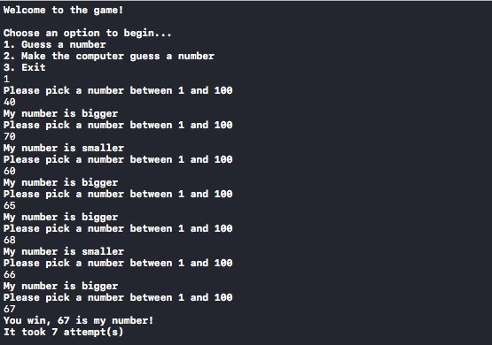

# Welcome to Guess Number Game!

A simple game developed in Swift that runs on a CLI, where you have two game modes, you can either guess a random number that has been generated by the computer or think a number for yourself and let the computer work it´s magic!

# How to play

Just download or clone the repo and run the project from Xcode. By default both games have their limits set between 1 and 100, but you may change that in main.swift at any moment using the method setLimits on either game before starting it. 

e.g.

    let gnh = GuessNumberHumanClass(inputType: read)
    gnh.setLimits(n1: 1, n2: 1000)
    gnh.start()

# Screenshots

